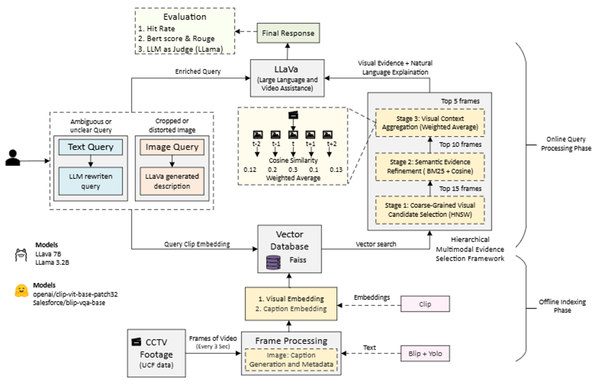

# VideoRAG: Video Retrieval-Augmented Generation System

A multimodal video retrieval and question-answering system that combines CLIP embeddings, FAISS indexing, and LLaVA for intelligent video search and analysis.



## Features

- **🔍 Text-based Video Search**: Search video content using natural language queries
- **🖼️ Image-based Video Search**: Find similar video segments using reference images
- **🎯 3-Stage Retrieval Pipeline**: Visual → Textual+BM25 → Temporal context ranking
- **🤖 AI-Powered Analysis**: Optional LLaVA integration for multimodal response generation
- **📊 Deep Analysis**: Detailed frame-by-frame analysis of video segments
- **📤 Video Upload**: Process and index your own video collections

## Architecture

The system implements a sophisticated retrieval pipeline:

1. **Preprocessing**: Videos are chunked into segments with keyframe extraction
2. **Feature Extraction**: CLIP embeddings for visual features, YOLO for object detection
3. **Indexing**: FAISS vector index for efficient similarity search
4. **3-Stage Reranking**:
   - Stage 1: Top 15 by Visual embedding (cosine similarity)
   - Stage 2: Top 10 by Textual embedding + BM25 scoring
   - Stage 3: Top 5 by Temporal context averaging
5. **Response Generation**: Optional LLaVA multimodal analysis

## Tech Stack

| Component | Technology |
|-----------|------------|
| Visual Embeddings | OpenAI CLIP (ViT-B-32) |
| Vector Search | FAISS |
| Object Detection | YOLOv8 |
| Multimodal LLM | LLaVA (via Ollama) |
| Text Embeddings | Sentence Transformers |
| Web Interface | Streamlit |
| Video Processing | OpenCV, FFmpeg |

## Installation

### Prerequisites

- Python 3.10+
- [Ollama](https://ollama.ai/) (for LLaVA support)
- FFmpeg (for video processing)

### Setup

1. **Clone the repository**
   ```bash
   git clone https://github.com/yourusername/VideoRAG.git
   cd VideoRAG
   ```

2. **Create virtual environment**
   ```bash
   python -m venv .venv
   .venv\Scripts\activate  # Windows
   # or
   source .venv/bin/activate  # Linux/Mac
   ```

3. **Install dependencies**
   ```bash
   pip install -r artifacts/requirements.txt
   ```

4. **Install Ollama models (optional, for AI analysis)**
   ```bash
   ollama pull llava:7b
   ollama pull llama3.2
   ```

## Usage

### Start the Application

```bash
streamlit run app_streamlit.py
```

The application will be available at `http://localhost:8501`

### Processing Videos

1. **Preprocess Videos**: Extract keyframes and generate captions
   ```bash
   python src/01_preprocess.py
   ```

2. **Extract Features**: Generate CLIP embeddings
   ```bash
   python src/02_extract_features.py
   ```

3. **Build Index**: Create FAISS index
   ```bash
   python src/03_index.py
   ```

### Querying

- **Text Search**: Enter natural language queries like "Find videos of a car accident"
- **Image Search**: Upload a reference image to find similar video segments
- **Deep Analysis**: Click on any result to get detailed AI-powered analysis

## Project Structure

```
VideoRAG/
├── app_streamlit.py      # Streamlit web application
├── src/
│   ├── 00_config.py      # Configuration settings
│   ├── 01_preprocess.py  # Video preprocessing
│   ├── 02_extract_features.py  # Feature extraction
│   ├── 03_index.py       # FAISS indexing
│   ├── 04_reranker.py    # Reranking logic
│   └── 05_query.py       # Query processing
├── artifacts/
│   └── requirements.txt  # Python dependencies
├── docs/
│   └── Architecture.png  # System architecture diagram
├── outputs/              # Generated outputs (gitignored)
├── sampledata/           # Sample video data (gitignored)
└── testscripts/          # Evaluation scripts
```

## Configuration

Key settings in `src/00_config.py`:

| Setting | Default | Description |
|---------|---------|-------------|
| `CHUNK_DURATION` | 3s | Video segment duration |
| `KEYFRAMES_PER_CHUNK` | 1 | Keyframes extracted per chunk |
| `CLIP_MODEL_NAME` | ViT-B-32 | CLIP model variant |
| `LLAVA_MODEL` | llava:7b | LLaVA model for analysis |
| `TOP_K_RETRIEVAL` | 5 | Number of results to return |

## Performance Notes

- **GPU Recommended**: CLIP and FAISS perform significantly faster with CUDA
- **CPU Mode**: LLaVA runs on CPU if no NVIDIA GPU is available (slower)
- **Memory**: Processing large video collections requires 8GB+ RAM

## License

MIT License

## Acknowledgments

- [OpenAI CLIP](https://github.com/openai/CLIP)
- [FAISS](https://github.com/facebookresearch/faiss)
- [Ollama](https://ollama.ai/)
- [Streamlit](https://streamlit.io/)
- [Ultralytics YOLOv8](https://github.com/ultralytics/ultralytics)
